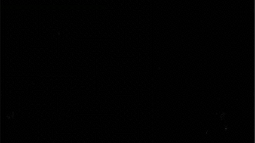

Examples
========

.. include:: ../../examples/example_comparator.py
    :literal:


<a>{{2}}


``isodata`` working
-------------------

    Video in better quality: http://www.youtube.com/watch?v=4meidkmJWP0

